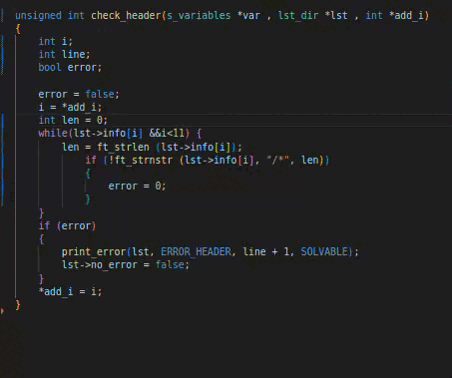
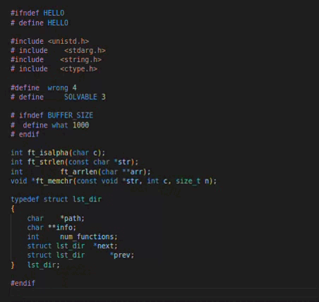

# NORMVIC

The NORMVIC is a tool to check that the source code respects the school’s norm AND CORRECTS ERRORS IT SELF.
<div>
  
  
</div>

### INSTALL

```
bash -c "$(curl -fsSL https://raw.github.com/VictorGT22/Normvic/master/bin/install/install.sh)"
```

### UPDATE

```
bash -c "$(curl -fsSL https://raw.github.com/VictorGT22/Normvic/master/bin/install/update.sh)"
```

## HOW WORKS
### Flags

|   Flags   |       Action       |
|-----------|--------------------|
| -i        | Show help          |
| no flag   | Evaluate .h and .c |
| -c / C    | Evaluate only .c   |
| -h / H    | Evaluate only .h   |
| -r / R    | Correct the errors |
| -s / S    | Don't show ok files|
| -g / G    | Rate the app       |
| -u / U    | Update to latest version|

### Type error

|   Error    |       Description     |
|------------|-------------------|
|    🔴     | No fixable        |
|    🟢     | Fixable   |
|    🟡     | Why you make this error ?  |


### ERRORS HANDELED

|   TYPE   |       ERROR MSG       |       DESCRIPTION      |
|-----------|----------------------|------------------------|
|    🟢     | ERROR_HEADER         | Header corrupted, try to verify |
|    🟢     | ERROR_TRALING_SPACE  | Traling spaces at the end of the line |
|    🟢     | ERROR_WRONG_TAB      | There is a Tab, where needs to be a Space |
|    🟢     | ERROR_WRONG_SPACE    | There is a Tab, where needs to be a Space |
|    🟢     | ERROR_SPACE_NAME_FUNC | Space between function name and brakets  |
|    🟢     | ERROR_CONSECUTIVE_NEWLINES | Two o more consecutive new lines |
|    🟢     | ERROR_HEADER_FILE    | Corrupted initialization header file |
|    🟢     | ERROR_INCLUDE_HEADER_FILE | Error Include in header file |
|    🟢     | ERROR_NO_EMPTY_LINE      | Error wrong empty line|
|    🟢     | ERROR_WRONG_EMPTY_LINE | Error Include in header file |
|    🔴     | ERROR_STRUCT_NAME     | Struct abreviation needs to start with 't_ |
|    🟢     | ERROR_SEMICOLON      | Space/Tab before semicolon at the endo of the line |
|    🟢     | ERROR_ENDIF      | Error at the ENDIF  |
|    🟢     | ERROR_VAR_ASIGNATION | Variable inicialitzation and asignation in the same line |
|    🔴     | ERROR_MANY_VAR   | To many variables inside a function |
|    🟢     | ERROR_NO_SPACE_KEYWORD | Needs to be a space after a keyword |
|    🟢     | ERROR_SPACE_BEFORE_INCREMENTAL      | Space before a incremental operator |
|    🟢     | ERROR_SPACE_AFTER_INCREMENTAL      | Space after a incremental operator |
|    🟢     | ERROR_NO_SPACE_BEFORE_OPERATOR      | Need to be a Space before a operator |
|    🟢     | ERROR_NO_SPACE_AFTER_OPERATOR      | Need to be a Space after a operator |
|    🟢     | ERROR_SPACE_BEFORE_STRUCT_OPERATOR | Space before a struct operator |
|    🟢     | ERROR_SPACE_AFTER_STRUCT_OPERATOR  | Space after a struct operator |
|    🔴     | ERROR_TO_LONG_LINE | Line to long, more than 80 columns |
|    🟢     | ERROR_VARIBALES_FOLLOWED      | Variable declaration must be at the start of the function |
|    🟢     | ERROR_INDENTATION       | Wrong Indentation |
|    🟢     | ERROR_COMMENT_FUNCTION  | Comment inside a function |
|    🟢     | ERROR_NO_EMPTY_LINE_VAR | Error no empty line between Variables and your code |
|    🟢     | ERROR_OPPERATOR_END     | Operator at the end of the line |
|    🟢     | ERROR_BRACKET_KEYWORD   | Curly bracket in the same line than a keyword or prototipe function |
|    🟢     | ERROR_BRACKET_NOEMPTY   | Curly bracket must be alone in the line |
|    🟢     | ERROR_CLOSE_BRACKET_NOEMPTY  | No empty line after a close curly bracket |
|    🟢     | ERROR_ENTER_FUNCTIONS      | Need to be a empty line between functions |
|    🟢     | ERROR_ENTER_END_FILE      | Need to be a empty line at the end of the file |
|    🟢     | ERROR_NAME_MACRO      | Macros needs to be named with all letters uppercase |
|    🔴     | ERROR_NUM_FUNCTIONS      | Too many functions inside a file |
|    🔴     | ERROR_NUM_LINES      | Too many lines in a function |
|    🔴     | ERROR_FILE_NAME      | Files and folders names must be in lowercase | (in the future)
|    🟢     | ERROR_SPACE_BEFORE_COMMA  | Must be no space before a comma |
|    🟢     | ERROR_SPACE_AFTER_COMMA   | Must be a space after a comma |
|    🟢     | ERROR_TERNARIAN      | Ternarians are forbiden, it sucks but it is what it is (That is amazing)|
|    🟢     | ERROR_SPACE_AFTER_PARENTHESIS | Space after parenthesis|
|    🟢     | ERROR_SPACE_BEFORE_PARENTHESIS| Space before parenthesis|
|    🟢     | ERROR_SPACE_FUNCTION| Space before name function and parenthesis |
|    🟢     | ERROR_SPACE_AFTER_BRACKETS | Space after square brackets|
|    🟢     | ERROR_SPACE_BEFORE_BRACKETS | Space before square brackets|
|    🟢     | ERROR_VOID | If a function does not receive anything, it must have the type void|
|    🟢     | ERROR_NO_TAB_START_VAR | No tab before var, cmon be focus when you code|
|    🟢     | ERROR_MISALIGNED | Variable misaligned|
|    🟢     | ERROR_MISALIGNED_PROTO | Prototype misaligned|
|    🟢     | ERROR_MULTIPLE_SPACES | Unecesary multiple space elements followed|
|    🟢     | ERROR_MAKEFILE | Wrong Makefile name|
|    🔴     | ERROR_REPO | You only can execute the NORMVIC inside a repo for security|
|    🟢     | ERROR_TAB_NAME_STRUCT | Must be a tab between } and struct name |
|    🟢     | ERROR_FUNC_NAME | Functions name must be in lowercase |


### Recomendations

Keep your code tidy:

- Project
  
  - Includes
    - projectname.h
    - projectname_struct.h

  - Sources
    - Folder 1
       - file.c
       - file.c
    - Folder 2
       - file.c
       - file.c

  - MAKEFILE
 
